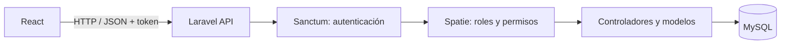

<div align="center">

# 🎬 CineNow

### Gestión de películas con roles, permisos y aprobación de cuentas

Una aplicación Full Stack para administrar un catálogo cinematográfico y controlar quién puede consultar, crear, editar o eliminar sus registros.

**React 19 · Laravel 13 · MySQL · Sanctum · Spatie Permission**

[Funcionalidades](#funcionalidades) · [Instalación](#instalación-en-otra-pc) · [Accesos](#roles-y-aprobación) · [API](#api-rest)

</div>

---

## Funcionalidades

- **Películas:** consulta, creación, edición y eliminación según los permisos asignados.
- **Autenticación:** registro, login con usuario o correo y cierre de sesión con Laravel Sanctum.
- **Aprobación de cuentas:** pantalla de espera para usuarios sin permisos.
- **Usuarios:** asignación de roles desde el panel del administrador.
- **Roles y permisos:** gestión de roles y sus permisos asociados.
- **Protección en Laravel:** la API verifica los accesos además de los controles de la interfaz.
- **Interfaz responsive:** validación de formularios, estados de carga y mensajes de error.

## Arquitectura



phpMyAdmin permite administrar y exportar MySQL. Laravel prepara las tablas mediante **migraciones** y carga los accesos iniciales mediante **seeders**.

## Requisitos

| Herramienta | Versión / condición |
| --- | --- |
| PHP | 8.3 o superior, compatible con `composer.lock` |
| Composer | 2.x |
| Node.js | Compatible con Vite: `^20.19.0` o `>=22.12.0` |
| npm | Incluido con Node.js |
| MySQL | Servidor iniciado |
| Git | Disponible en la terminal |
| Laragon / phpMyAdmin | Opcionales para facilitar el entorno local |

Habilita las extensiones requeridas por Laravel y `pdo_mysql`. Para las pruebas también necesitas `pdo_sqlite`.

```sh
php -v
composer --version
node -v
npm -v
git --version
```

## Instalación en otra PC

### 1. Clonar el repositorio

```sh
git clone https://github.com/davidsandovalmarenco/cinenow-react-laravel.git
cd cinenow-react-laravel
```

### 2. Preparar el backend

```sh
cd backend
composer install
```

Crea la configuración local en **PowerShell**:

```powershell
Copy-Item .env.example .env
```

En **Linux o macOS**:

```sh
cp .env.example .env
```

Genera la clave para esta instalación:

```sh
php artisan key:generate
```

### 3. Configurar MySQL

Inicia MySQL y crea una base vacía llamada `cinenow` desde phpMyAdmin o con SQL:

```sql
CREATE DATABASE cinenow CHARACTER SET utf8mb4 COLLATE utf8mb4_unicode_ci;
```

Edita `backend/.env`. La plantilla usa SQLite: **reemplaza `DB_CONNECTION=sqlite` y habilita las variables de MySQL**, sin duplicarlas.

```dotenv
APP_NAME=CineNow
APP_URL=http://127.0.0.1:8000

DB_CONNECTION=mysql
DB_HOST=127.0.0.1
DB_PORT=3306
DB_DATABASE=cinenow
DB_USERNAME=root
DB_PASSWORD=
```

Ajusta el puerto, usuario y contraseña según tu equipo. Desde `backend`, ejecuta:

```sh
php artisan config:clear
```

### 4. Crear las tablas, roles y administrador

**Instalación nueva:** ejecuta desde `backend`:

```sh
php artisan migrate
php artisan db:seed
```

Esto crea las tablas, los tres roles iniciales, diez permisos y el administrador `david`. El catálogo comienza vacío.

**Si tienes un respaldo `.sql`:** impórtalo en la base vacía desde phpMyAdmin **antes de ejecutar esos dos comandos**. Después ejecuta igualmente `migrate` y `db:seed` para agregar las migraciones y accesos que falten en una copia antigua.

> Usa `migrate` para aplicar cambios pendientes. No uses `migrate:fresh` ni `migrate:refresh` sobre una base que quieras conservar: pueden borrar tablas y datos.

El seeder conserva la contraseña de `david` si ya existe y le asigna el rol Administrador. También restablece los permisos definidos para los roles iniciales; tenlo en cuenta si los personalizaste.

### 5. Iniciar Laravel

Desde `backend`:

```sh
php artisan serve --host=127.0.0.1 --port=8000
```

Deja la terminal abierta. La API estará en `http://127.0.0.1:8000/api`.

### 6. Preparar e iniciar React

Abre una **segunda terminal** en la raíz del repositorio:

```sh
cd frontend
npm ci
npm run dev
```

Abre la dirección que indique Vite, normalmente **http://localhost:5173**.

Los servicios de `frontend/src/services/` apuntan a `http://127.0.0.1:8000/api`. Si cambias la dirección del backend, actualiza las URLs de esos servicios.

### 7. Iniciar sesión

| Campo | Valor inicial |
| --- | --- |
| Usuario | `david` |
| Correo alternativo | `david@cinenow.test` |
| Contraseña | `12345` |
| Rol | Administrador |

Estas credenciales son para la demostración local. Si importaste un usuario `david` existente, usa su contraseña anterior.

## Roles y aprobación

| Acción | Administrador | Editor | Consulta |
| --- | :---: | :---: | :---: |
| Ver películas | ✓ | ✓ | ✓ |
| Crear películas | ✓ | ✓ | — |
| Editar películas | ✓ | ✓ | — |
| Eliminar películas | ✓ | — | — |
| Administrar roles y permisos | ✓ | — | — |
| Asignar roles a usuarios | ✓ | — | — |

### Aprobar una cuenta

1. El usuario se registra desde **Crear cuenta**.
2. Como no tiene permisos, ve **Cuenta pendiente de aprobación**.
3. David u otro administrador entra en **Usuarios**.
4. Edita la cuenta, selecciona un rol y guarda los cambios.
5. El usuario pulsa **Comprobar aprobación** para actualizar su acceso.

La aprobación funciona mediante la asignación de permisos a través de roles. Una cuenta sin permisos sigue en espera. No se envían notificaciones automáticas al administrador.

## Uso diario

Después de instalar, inicia MySQL y ejecuta estos comandos en dos terminales:

| Terminal | Carpeta | Comando |
| --- | --- | --- |
| Backend | `backend` | `php artisan serve --host=127.0.0.1 --port=8000` |
| Frontend | `frontend` | `npm run dev` |

No necesitas reinstalar dependencias ni ejecutar seeders cada vez que abres el proyecto.

## Respaldar y trasladar los datos

**Clonar el repositorio no copia los registros de tu MySQL local.** Git conserva el código, las migraciones y los seeders.

Para trasladar también películas, usuarios y permisos:

1. Selecciona la base `cinenow` en phpMyAdmin.
2. Exporta **todas las tablas**, con estructura y datos, en formato SQL.
3. Lleva el respaldo a la nueva PC.
4. Sigue la instalación e impórtalo en el paso 4.

Incluye `users`, `roles`, `permissions`, `role_has_permissions`, `model_has_roles`, `model_has_permissions` y `migrations`, además de `peliculas` y las otras tablas del sistema.

El archivo `.env` es local y no se versiona. Cada equipo debe configurarlo desde `.env.example`.

## Estructura

```text
cinenow-react-laravel/
├── backend/
│   ├── app/Http/Controllers/Api/   # Autenticación, películas y accesos
│   ├── app/Models/                # Modelos de datos
│   ├── database/migrations/       # Estructura de las tablas
│   ├── database/seeders/          # Roles, permisos y administrador
│   ├── routes/api.php            # Rutas protegidas
│   └── tests/                    # Pruebas del backend
├── frontend/
│   ├── src/context/              # Estado de autenticación
│   ├── src/pages/                # Pantallas de la aplicación
│   └── src/services/             # Conexión con la API
└── README.md
```

## API REST

Base local: `http://127.0.0.1:8000/api`.

| Método | Ruta | Acceso |
| --- | --- | --- |
| POST | `/register` | Público |
| POST | `/login` | Público |
| GET | `/me` | Autenticado |
| POST | `/logout` | Autenticado |
| GET | `/peliculas`, `/peliculas/{id}` | `peliculas.ver` |
| POST | `/peliculas` | `peliculas.crear` |
| PUT / PATCH | `/peliculas/{id}` | `peliculas.editar` |
| DELETE | `/peliculas/{id}` | `peliculas.eliminar` |
| GET / POST | `/roles` | Administrador |
| GET / PUT / PATCH / DELETE | `/roles/{id}` | Administrador |
| GET / POST | `/permissions` | Administrador |
| GET | `/users` | Administrador |
| PUT | `/users/{id}/roles` | Administrador |

Las rutas protegidas requieren el token devuelto al iniciar sesión:

```http
Accept: application/json
Content-Type: application/json
Authorization: Bearer <token>
```

Para consultar las rutas desde `backend`:

```sh
php artisan route:list --path=api
```

## Verificación

Desde `backend`:

```sh
php artisan test
```

Las pruebas de acceso usan SQLite en memoria y cubren registro sin permisos, aprobación por un administrador, restricciones y creación, edición y eliminación de películas.

Desde `frontend`:

```sh
npm run build
```

La compilación se genera en `frontend/dist`.

## Solución de problemas

| Problema | Solución |
| --- | --- |
| No se reconoce `php`, `composer` o `npm` | Instala la herramienta y configura `PATH`. En Laragon puedes usar su terminal. |
| `could not find driver` | Habilita `pdo_mysql`, o `pdo_sqlite` para las pruebas, en el PHP usado por la terminal. |
| Error de conexión a MySQL | Revisa que el servidor esté iniciado y que `.env` tenga la base, puerto y credenciales correctos. Ejecuta `php artisan config:clear`. |
| Faltan tablas de roles o la columna `username` | Ejecuta `php artisan migrate` en `backend`. |
| Faltan roles o el administrador inicial | Ejecuta `php artisan db:seed`; considera la nota sobre restablecer los permisos iniciales. |
| React no conecta con Laravel | Verifica el backend en `127.0.0.1:8000` y las URLs de `frontend/src/services/`. |
| Respuesta `401` | Inicia sesión nuevamente. |
| Respuesta `403` o pantalla de espera | Un administrador debe asignar el acceso necesario desde **Usuarios**. |
| Los permisos no se actualizan | Ejecuta `php artisan permission:cache-reset` y vuelve a iniciar sesión o pulsa **Comprobar aprobación**. |
| Vite falla por la versión de Node.js | Revisa `node -v` y los requisitos de este README. |

---

<div align="center">

**David Sandoval Marenco**

Proyecto académico · **Electiva PPF II**

Desarrollado con React, Laravel y MySQL.

</div>
